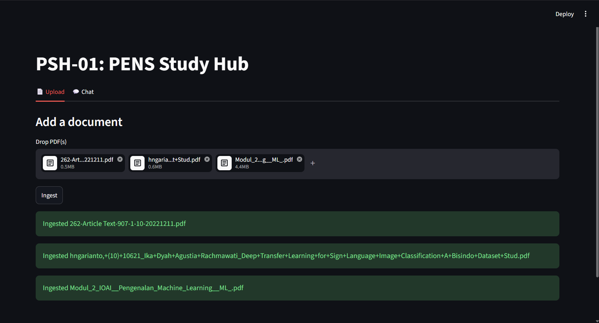
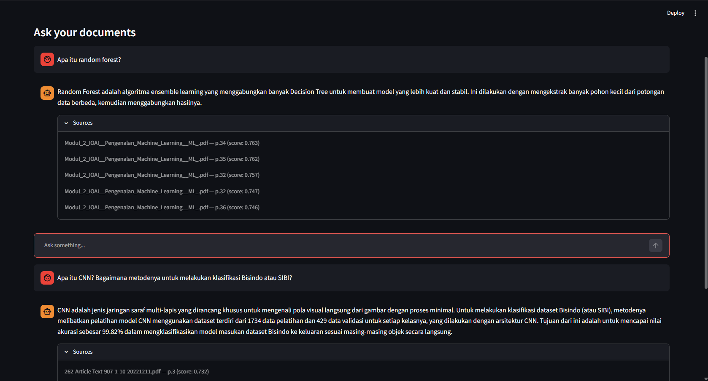

  # PSH-01: Personal Study Hub — Local RAG Core

A fully local, offline Retrieval-Augmented Generation (RAG) system for querying academic PDF documents. Drop a PDF in, ask questions about it, get answers with page-level citations — no cloud API calls, running entirely on consumer hardware.

This is the first module of a larger personal knowledge system (PSH), scoped narrowly to prove out the RAG pipeline in isolation before it's wired into downstream automation (document ingestion pipelines, note-taking integration, etc.).

## Why this exists

Most RAG tutorials assume a GPU and an OpenAI API key. This project deliberately does neither — every model was benchmarked and chosen against a **Ryzen 7 5700H, Vega iGPU, 16GB single-channel RAM**, the kind of constraint most students and early-career engineers actually work under. The goal wasn't just "make RAG work," but to make every architectural decision defensible: why this chunk size, why this LLM over three alternatives, why this embedding model — with the tradeoffs written down, not just the winner.

## Architecture

| Component | Choice | Why |
|---|---|---|
| Vector DB | Qdrant (Docker) | 384-dim cosine similarity; metadata filtering (filename, page) built in from the start for future course/date/source tagging |
| LLM | `qwen2.5:3b-instruct-q4_K_M` (Ollama) | Benchmarked against a 7B model and Llama3.2:3B — best prompt eval speed (61.72 tok/s) on the target hardware |
| Embeddings | `bge-small-en-v1.5` (SentenceTransformers) | Tied retrieval quality with `nomic-embed-text`, ~2x faster batch embedding |
| Chunking | 512 tokens / 50 overlap | 256-token chunks were also tested; didn't resolve topic bleed between similar sections, so reverted |
| Point IDs | `uuid5(filename + page + chunk_index)` | Deterministic — re-ingesting the same file overwrites cleanly instead of creating duplicates |
| Interface | Streamlit | Upload tab (PDF → ingest) + Chat tab (question → answer + source citations) |

## Setup

**Prerequisites:** Docker, [Ollama](https://ollama.com) installed locally, Python 3.10+

```bash
# 1. Clone and set up the environment
git clone https://github.com/Davino-Edric/PSH-01.git
cd PSH-01
mkdir -p data/pdfs
python -m venv .venv
source .venv/bin/activate  # or .venv\Scripts\activate on Windows
pip install -r requirements.txt

# 2. Start Qdrant
docker-compose up -d

# 3. Pull the LLM
ollama pull qwen2.5:3b-instruct-q4_K_M

# 4. Create the Qdrant collection (run once)
python create_collection.py

# 5. Launch the app
streamlit run app.py
```

Drop a PDF into the **Upload** tab, wait for ingestion to confirm, then switch to **Chat** and ask questions. Answers include an expandable **Sources** panel showing filename, page number, and retrieval score for every cited chunk.

## Known limitations

These are documented tradeoffs, not bugs waiting to be fixed — each was a deliberate scope decision:

- **Cross-lingual spelling variants aren't matched.** `bge-small-en-v1.5` is English-trained, so it treats terms like Indonesian "Linier" and English "Linear" as unrelated, which can cause retrieval misses on mixed-language documents.
- **Topic bleed between similar sections.** Content like "Simple" vs. "Multivariate Linear Regression" can bleed across chunk boundaries — this reflects genuine content similarity rather than a chunking defect; reducing chunk size to 256 tokens didn't resolve it.
- **Front-matter filtering is Roman-numeral only.** `is_front_matter()` catches table-of-contents/cover pages labeled with Roman numerals but won't catch unlabeled front matter.
- **Corrupted or image-only PDFs fail cleanly, not silently.** Documents with no extractable text (scanned images, corrupted files) raise a clear error at ingestion rather than producing an empty or broken index.

## Project structure

```
.
├── docker-compose.yml      # Qdrant service definition
├── create_collection.py    # One-time Qdrant collection setup
├── ingest.py                # PDF → chunk → embed → upsert pipeline
├── query.py                  # Question → retrieve → generate → cite pipeline
├── app.py                     # Streamlit UI (upload + chat tabs)
└── requirements.txt
```

## Streamlit UI Documentations

**Upload tab**


**Chat tab with source citations**


## Future Work

The current system covers the core RAG loop end-to-end. The items below are 
deliberately out of scope for v1 — noted here as a roadmap, not oversights.

| Improvement | Why | Effort |
|---|---|---|
| **Multilingual embedding model** (e.g. `paraphrase-multilingual-MiniLM-L12-v2`) | Would resolve the ID/EN spelling-variant gap noted in Known Limitations, at the cost of the batch-speed advantage `bge-small-en-v1.5` currently has. Deferred pending a re-benchmark to confirm the quality/speed tradeoff is worth it. | Low — config + re-embed existing corpus |
| **Chatbot-style UI/UX** (vs. current Streamlit layout) | Streamlit was the right choice for fast iteration during development; a dedicated chat frontend (e.g. custom React/Next.js, or a framework like Chainlit) would read as more production-realistic for demo purposes. | Medium — new frontend layer, same backend |
| **Query understanding + re-ranking + answer verification** | Right now retrieval is a single embed-and-search step with no query rewriting, no re-ranking of retrieved chunks, and no check that the generated answer is actually grounded in what was retrieved. Adding an LLM-driven query planner, a re-ranking model, and a verification pass would meaningfully improve answer quality — but each stage adds latency, which is a real constraint on CPU-only inference. Worth prototyping once the core system has more real usage to justify it. | High — effectively a v2 architecture (agentic RAG) |
| **Inline, chunk-level citations** | Currently citations are per-answer (a list of sources used), not per-sentence. Pinpointing exactly which retrieved chunk supports which specific claim in the generated answer would be a meaningfully stronger trust signal, but requires either structured prompting to force the LLM to tag its own claims, or a separate alignment step post-generation. | Medium-High — prompt engineering + possible new pipeline stage |

## What's next

This module is scoped to stand alone, but its ingestion script signature and Qdrant schema are kept clean enough to be wired into future PSH sub-projects (automated document intake, note-taking integration) without a rewrite.
