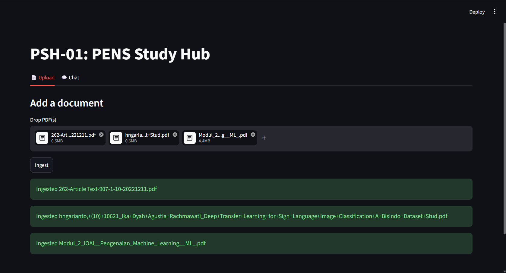
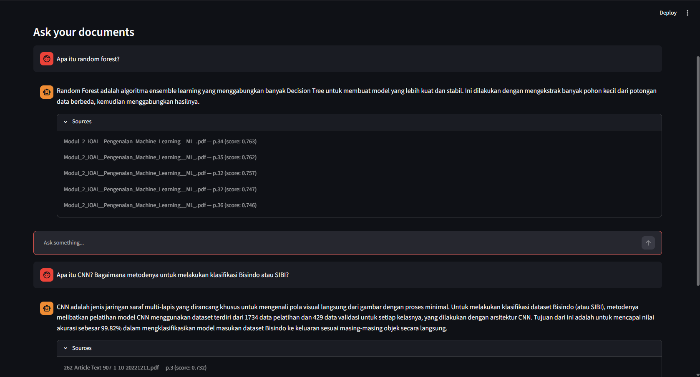

# PSH-01: Personal Study Hub — Local RAG Core

**Status: Complete — retired as a prototype.** Superseded by an in-progress, from-scratch production rebuild, currently in a dedicated R&D phase. See [What's next](#whats-next).

A fully local, offline Retrieval-Augmented Generation (RAG) system for querying academic PDF documents. Drop a PDF in, ask questions about it, get answers with page-level citations — no cloud API calls, running entirely on consumer hardware.

This is the first module of a larger personal knowledge system (PSH), scoped narrowly to prove out the RAG pipeline in isolation before it's wired into downstream automation (document ingestion pipelines, note-taking integration, etc.).

## Why this exists

Most RAG tutorials assume a GPU and an OpenAI API key. This project deliberately does neither — every model was benchmarked and chosen against a **Ryzen 7 5700H, Vega iGPU, 16GB single-channel RAM**, the kind of constraint most students and early-career engineers actually work under. The goal wasn't just "make RAG work," but to make every architectural decision defensible: why this chunk size, why this LLM over three alternatives, why this embedding model — with the tradeoffs written down, not just the winner.

## Architecture

| Component | Choice | Why |
|---|---|---|
| Vector DB | Qdrant (Docker) | 768-dim cosine similarity; metadata filtering (filename, page, course) is live as of v1.1 — folder-inferred course tagging with an `uncategorized` fallback for root-level files |
| LLM | `qwen2.5:3b-instruct-q4_K_M` (Ollama) | Benchmarked against a 7B model and Llama3.2:3B — best prompt eval speed (61.72 tok/s) on the target hardware |
| Embeddings | `intfloat/multilingual-e5-base` (SentenceTransformers) | Migrated from `bge-small-en-v1.5` in v1.1 specifically to close a cross-lingual (Indonesian/English) retrieval gap. Explicitly **not** a speed upgrade — measured ~1.85x latency over `bge-small`, a tradeoff accepted deliberately for cross-lingual correctness. Uses E5's task-prefix convention (`"passage: "` on ingestion, `"query: "` on retrieval) |
| Chunking | 512 tokens / 50 overlap | 256-token chunks were also tested; didn't resolve topic bleed between similar sections, so reverted |
| Point IDs | `uuid5(filename + page + chunk_index + course_tag)` | Deterministic — re-ingesting the same file overwrites cleanly instead of creating duplicates |
| Batch size | 16 (embedding) | Deliberately capped rather than maximized — preserves CPU responsiveness for interactive use during background ingestion |
| Ingestion ledger | SQLite (`psh_ledger.db`, WAL mode) | Tracks filename, course, status, and timestamp per ingested document — the record downstream automation reads from to know what's already been processed |
| Interface | Streamlit | Upload tab (PDF → ingest) + Chat tab (question → answer + source citations) |

## Setup

**Prerequisites:** Docker, [Ollama](https://ollama.com) installed locally, Python 3.10+

```bash
# 1. Clone and set up the environment
git clone https://github.com/Davino-Edric/PSH-01.git
cd PSH-01
mkdir -p data/pdfs
python -m venv .venv
source .venv/bin/activate  # or .venv\Scripts\activate on Windows
pip install -r requirements.txt

# 2. Start Qdrant
docker-compose up -d

# 3. Pull the LLM
ollama pull qwen2.5:3b-instruct-q4_K_M

# 4. Create the Qdrant collection (run once)
python create_collection.py

# 5. Launch the app
streamlit run app.py
```

Drop a PDF into the **Upload** tab, wait for ingestion to confirm, then switch to **Chat** and ask questions. Answers include an expandable **Sources** panel showing filename, page number, and retrieval score for every cited chunk.

**Course tagging (new in v1.1):** documents are tagged by the folder they're placed in — `data/pdfs/[Course_Name]/file.pdf` — inferred automatically at ingest time. Files placed directly in `data/pdfs/` with no course subfolder are tagged `uncategorized` rather than rejected. A SQLite ledger at `data/psh_ledger.db` is created automatically on first ingest and tracks the status of every document processed.

## Known limitations

These are documented tradeoffs and open issues — status is stated precisely for each, not rounded up to "fixed" or down to "still broken":

- **Cross-lingual spelling variants — substantially improved, not resolved.** The v1.1 embedding migration was built specifically to close this gap, and a standalone term-pair test confirmed real improvement (11/12 correct, vs. `bge-small`'s 6/12). A document-level retrieval test told a more mixed story: 2/4 passed, with both misses traced to bibliography/reference-list pages acting as distractors — a source-document quality issue more than a pure embedding failure, but still a real miss rate worth knowing before trusting cross-lingual queries fully.
- **Topic bleed between similar sections.** Content like "Simple" vs. "Multivariate Linear Regression" still bleeds across chunk boundaries — reconfirmed post-migration (13/15 on the retrieval-quality test, both misses ranked #2 by a narrow ~0.01–0.02 margin, both the same shape: a question missing the one detail that distinguishes two topically-adjacent chunks). This reflects genuine content similarity, not a chunking defect — reducing chunk size to 256 tokens didn't resolve it either.
- **Front-matter filtering is Roman-numeral only.** `is_front_matter()` catches table-of-contents/cover pages labeled with Roman numerals but won't catch unlabeled front matter. Unchanged since v1.0.
- **Whole-document extraction failures fail loudly, by design.** A PDF that yields zero extractable text across the entire document (scanned images, corrupted files) raises a clear `ValueError` at ingestion rather than silently producing an empty or broken index.
- **Individual pages with zero extractable text are silently skipped, not recovered.** A small number of pages within an otherwise-fine document can extract to zero text — confirmed via both `pypdf` and PyMuPDF, with no embedded raster image found either, suggesting vector-outlined content (e.g. a code screenshot converted to paths) rather than real glyphs or a scannable image. `MIN_CHUNK_CHARS=10` stops these near-empty chunks from polluting retrieval results, but this is a mitigation, not a fix — the content is excluded, not recovered.
- **Citation page numbers can drift from physical position.** A page's printed label and its actual position in the file have been observed to disagree by roughly 10 pages in one test document — a citation like "page 94" can point a reader to the wrong physical page.
- **Duplicate printed page labels within one document.** A handful of pages near the front of a file can share the same printed number (e.g. "2" appearing on 3 different physical pages). Not data loss — `chunk_index` is a global counter, so there's no ID collision — but the payload currently can't distinguish which physical page a given chunk actually came from.
- **Point-ID scheme is fragile to any change in chunk survivorship, not just renames.** Because point IDs are derived in part from `chunk_index`, any change to which chunks survive splitting reshuffles every downstream index and can orphan old points instead of overwriting them — observed directly during testing, where a collection's point count churned 201 → 323 → 193 before stabilizing. Recovery currently requires a full collection drop and re-ingest.

## Project structure

```
.
├── docker-compose.yml     # Qdrant service definition
├── create_collection.py   # One-time Qdrant collection setup (768-dim)
├── ingest.py               # PDF → chunk → embed → upsert pipeline, + course tagging + SQLite ledger writes
├── query.py                 # Question → retrieve → generate → cite pipeline
├── app.py                    # Streamlit UI (upload + chat tabs)
├── requirements.txt
├── dev/                         # standalone test/profiling scripts (embedding benchmarks, sanity checks, retrieval-quality tests)
└── data/                         # gitignored — pdfs/[course]/ and psh_ledger.db live here at runtime
```

## What's next

PSH-01 is complete and retired as a prototype. It did what it set out to do — prove the core RAG loop works end-to-end on consumer hardware, with every architectural decision benchmarked and written down rather than assumed.

The next step isn't an incremental patch on this codebase. A planned extraction-layer migration (to support PPTX, DOCX, and image inputs, not just PDF) surfaced enough structural questions — how chunking, point IDs, and citations should work once "page" isn't a universal concept across formats — that the decision was made to treat those as first-class questions for a from-scratch, production-oriented rebuild, rather than retrofitting them onto code that was never designed for multi-format support. That rebuild is currently in a dedicated R&D phase, evaluating stack choices against current industry practice rather than against what was fastest to learn or easiest to run on this specific laptop.

This repository stays as the reference implementation and proof of concept — the record of what was tried, what was measured, and what broke.
## Streamlit UI Documentations

**Upload tab**


**Chat tab with source citations**

